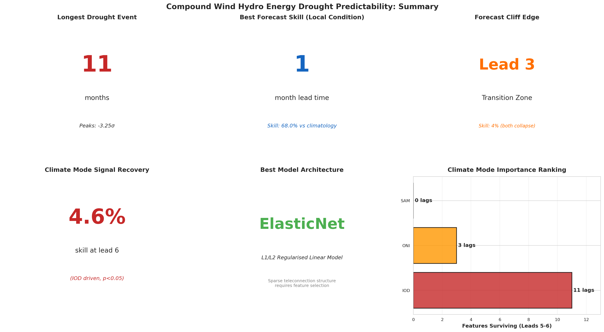

# Can Compound Wind Hydro Energy Droughts in Patagonia Be Predicted from Large-Scale Climate Modes?



## Overview

Patagonia hosts Argentina's largest concentration of wind energy capacity (2+ GW along the Atlantic coast) and its most important hydroelectric system (the Limay-Neuquén-Negro cascade, 4+ GW). Both resources are sensitive to large scale climate variability; wind generation depends on the strength and position of the Southern Hemisphere westerly jet, while hydroelectric inflows depend on Andean snowmelt and precipitation. This project investigates whether large scale climate modes (the Southern Annular Mode, ENSO, and potentially the Indian Ocean Dipole) can predict compound wind hydro energy droughts. These are periods when both resources simultaneously underperform, and if so, how far in advance.

## Interactive Composite Anomaly Map

An interactive spatial anomaly explorer is available below:

[Open Interactive Composite Map](https://sgosmyt2.github.io/patagonia-energy-drought/composite_anomaly_map.html)

The map allows exploration of:
- Positive and negative SAM phases
- ENSO warm/cold phases
- Positive and negative IOD phases
- Wind speed anomaly composites
- Runoff anomaly composites
- Spatial exposure of Patagonia energy infrastructure

## Answer

#### **Yes**.
However predictability depends strongly on forecast lead times and on which climate mode is used. Climate modes specifically add predictive skill best at leads 5-7 months, with local variables being dominant before that and the models struggling past 7 months.

## Key Findings

- 31 compound wind hydro drought events were identified between 1979-2025 using the WHDI3 index.
- The most severe event occurred during 2016 and persisted for 11 months during the decay phase of the 2015–16 Super El Niño.
- SAM exhibits the strongest immediate relationship with Patagonia energy conditions, reflecting direct control over Southern Hemisphere westerly circulation.
- IOD provides the strongest medium lead predictive signal, particularly at seasonal (5-7 month) horizons.
- Forecast skill is highly non monotonic:
  - local persistence dominates at short leads,
  - predictability collapses near lead 3,
  - climate mode skill re emerges at seasonal leads.
- ElasticNet outperformed Random Forest, XGBoost, and LSTM models, suggesting the teleconnection structure is relatively sparse and linear.
- Significant long term trends were detected in temperature, precipitation, runoff, and snowmelt, while wind speed trends remained weak.
- Spatial composite anomaly mapping revealed coherent regional responses in both runoff and wind fields during different climate mode phases.

## Data
ERA5 Reanalysis (Copernicus Climate Data Store)
	- Spatial domain: 38°S-47.5°S, 72°W-62°W
 	- Temporal domain: 1979-2025
 	- Resolution: 0.25° monthly
 	- Processing: Area weighted average across land grid cells within bounding box
SAM Index (British Antarctic Survey)
	- Southern Annular Mode (Marshall)
	- British Antarctic Survey
	- 1957-present
ONI (NOAA CPC)
	- Oceanic Niño Index
	- NOAA CPC
	- 1950-present
IOD/DMI
	-  Indian Ocean Dipole Mode Index
	-  NOAA PSL / BOM
	- 1870–present

The SAM (Marshall station based index) is used rather than an ERA5 derived SAM to maintain independence between predictor and predictand datasets. The ONI is provided as a 3 month running mean. IOD inclusion is pending literature review.

## Methodology

### Compound Drought Index

Wind speed and runoff are standardised independently by calendar month to remove seasonal cycles, then averaged into a compound Wind Hydro Drought Index (WHDI). Equal weighting is used to avoid introducing infrastructure capacity assumptions into a climate analysis. Drought events are catalogued when WHDI3 drops below  -1.0 (moderate),  -1.5 (severe), or  -2.0 (extreme), following standardised conventions.

### Teleconnection Analysis

Lag correlation analysis quantifies the relationship between each climate mode (SAM, ONI, IOD) and the WHDI at lead times of 0-12 months. Significance is tested using effective degrees of freedom to account for autocorrelation. Composite analysis maps the spatial pattern of wind and runoff anomalies during positive vs negative phases of each climate mode. All analyses are stratified by season to capture the known seasonal dependence of Southern Hemisphere teleconnections.

### Machine Learning Forecasting

Four modelling paradigms are compared to determine which is most appropriate for climate teleconnection prediction:
	- ElasticNet
	- Random Forest
	- XGBoost
	- LSTM

## Notebooks
1. Data Collection
2. Climatology & Index Construction
3. Teleconnection Analysis
4. ML Forecasting & Anomaly Detection
5. Synthesis & Visualization

## Setup
```bash
conda env create  -f environment.yml
conda activate patagonia-energy
